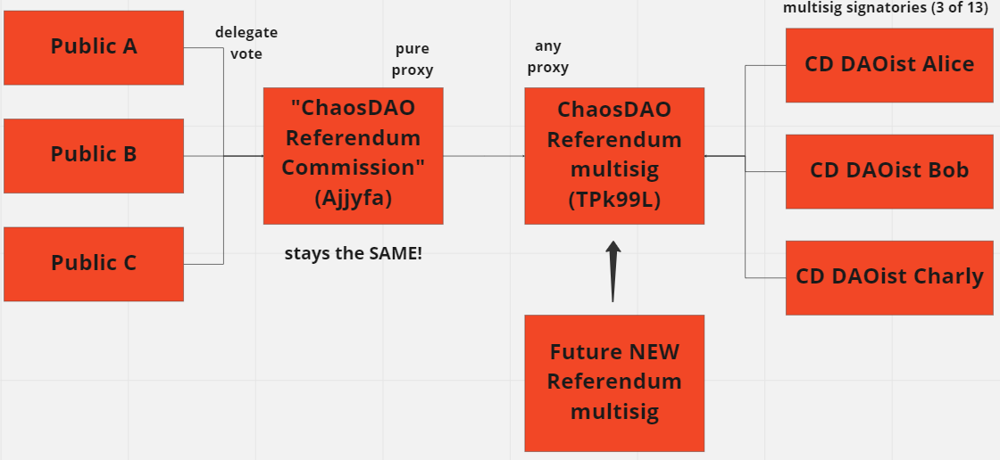

# External Governance

## Goals:
1) Actively vote on Kusama governance when there is clear agreement within our diverse decentralized organization of highly involved community builders. By organizing a single collective public voting account, we can demonstrate leadership within the community.
2) Offer community members that have no time to get involved, a way to make their vote count for OpenGov while being sure it reflects what's best for the community.
3) If many people delegate their vote to ChaosDAO, perhaps it will help our public voice swap contentious governance votes. Together we are stronger.

With the launch of Gov 2.0 or "OpenGov" on Kusama in Nov'2022, ChaosDAO officially launched our account and got involved with governance voting. Our multisig voted in favor of the first OpenGov referendum: Expect Chaos!
https://kusama.subscan.io/extrinsic/15465247-2

## How to delegate to the ChaosDAO voting proxy:
To delegate your vote to ChaosDAO, go to https://polkadot.js.org/apps/#/extrinsics and submit democracy->delegate(to, conviction, balance). For "AccountId" use DCZyhphXsRLcW84G9WmWEXtAA8DKGtVGSFZLJYty8Ajjyfa which has identity "ChaosDAO_Referendum_Commission"

## Internal Decision Process:
1) OpenGov team migrates on-chain referenda to ChaosDAO internal "OpenGov" forum.
2) Internal vote is open for 3 days and both DAOists and Regulars can discuss and vote internally on referenda with equal weight. One person is one vote.
3) After the 3 days have passed, if 67% or more of the votes are for Aye or Nay, the OpenGov team will reflect this on chain with a CD multisig vote.

Note that CD "Frens" cannot currently see or participate in the internal "OpenGov" discusssions and votes which began 2022-12-03, but this is likely to change in the future.

## Voting Proxy Account Technical Details:
How can we make it future proof as signatories change, while making frequent multisig votes quick and painless?

First, of course we created a multisig to vote with, so that no rogue individual could vote without consensus amongst our diverse membership. But within a volunteer organization gathering signatures for a multisig tx can be like pulling teeth. So we used a looser threshold of 3-of-13 since there’s usually three trusted DAOists around to sign when needed. Including 13 people, all previous multisig signatories, also allows sub-teams to focus on different referendum tracks in the future

However, Polkadot.js deterministic multisigs are brittle. Crypto community involvement fluctuates, so multisig signatories may become inactive over time. Changing signatories changes the acct address, breaking vote delegation. Therefore, we’ve set up a pure proxy which our multisig controls. If we need to change the team member composition of our multisig in the future, we can add a new multisig to control the proxied acct and remove the old multisig. Now the proxy voting acct (Ajjyfa) will be permanent, allowing anyone in the public to delegate their votes to our pure proxy voting acct without being disrupted if we internally update the members of our referendum voting multisig.

