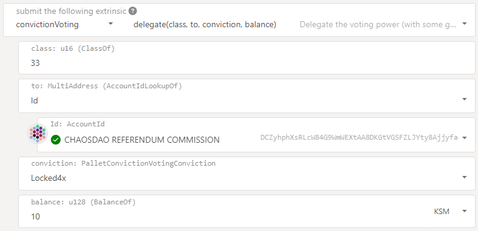
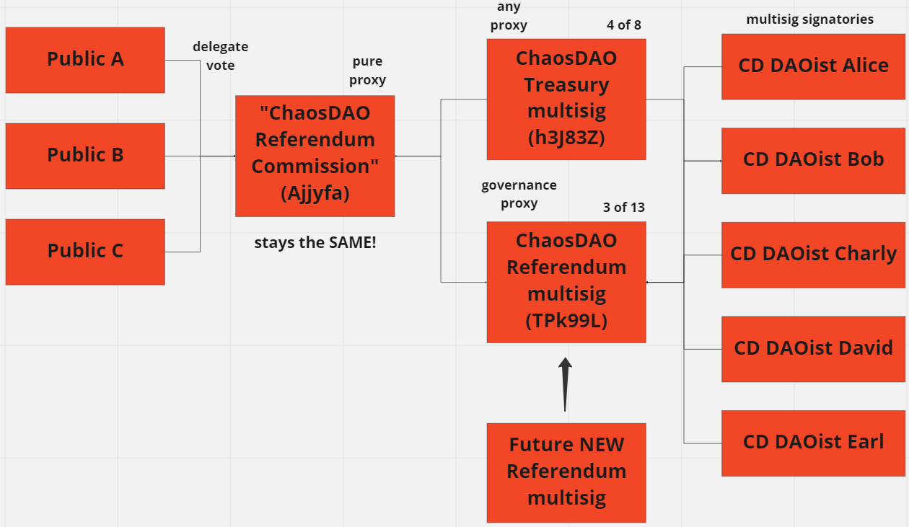

# External "OpenGov" Voting by ChaosDAO Community

## ChaosDAO Goals:
1) Actively vote on Kusama governance when there is clear agreement within our diverse decentralized organization of highly involved community builders. By organizing a single collective public voting account, we can demonstrate leadership within the community.
2) Offer community members that have no time to get involved a way to make their vote count in on-chain governance while being sure it reflects what's best for the community.
3) If many people delegate their vote to ChaosDAO, perhaps it will help our community voice influence contentious governance votes. Together we are stronger.

With the launch of Gov 2.0 or "OpenGov" on Kusama in Nov'2022, ChaosDAO officially launched our account and got involved with governance voting. Our multisig voted in favor of the first OpenGov referendum: Expect Chaos!
https://kusama.subscan.io/extrinsic/15465247-2

## How to delegate to the ChaosDAO voting proxy:

To delegate your vote for Kusama governance, you'll need to submit an "extrinsic" on-chain, which you can do at https://polkadot.js.org/apps/#/extrinsics
This website can quickly help you generate the correct extrinsics to delegate your vote: https://backend-opengov.math-crypto.com/
This lengthy video from Leemo explains OpenGov and shows how to generate and submit the extrinsics to delegate your vote: https://youtu.be/ZcqOTNzmGr0?t=565

### To delegate voting for newer "Gov2" / "OpenGov" referendums:
* Submit the `convictionVoting->delegate(class, to, conviction, balance)` extrinsic
  * For `class`, indicate the numbered governance track that you'd like to delegate for.
    * A list of OpenGov governance tracks is available here: https://docs.google.com/spreadsheets/d/1DlJcS3vhqQ8sjCD7UsLsboWN962s4qWkrtzWz7rQke8/edit#gid=0
  * For `AccountId` use `DCZyhphXsRLcW84G9WmWEXtAA8DKGtVGSFZLJYty8Ajjyfa` which has identity "ChaosDAO_Referendum_Commission"

  

### To delegate voting for "Gov1" referendums which use the older extrinsics:
* Submit the `democracy->delegate(to, conviction, balance)` extrinsic
  * For `AccountId` use `DCZyhphXsRLcW84G9WmWEXtAA8DKGtVGSFZLJYty8Ajjyfa` which has identity "ChaosDAO_Referendum_Commission"
* Note that if you have previously voted in Gov1 referendums with this account, the Gov1 delegation extrinsic will likely fail with an error code `AlreadyVoting` which indicates "The account currently has votes attached to it and the operation cannot succeed until these are removed, either through unvote or reap_vote." Your choices are then either to 1) don't bother with it. just delegate Gov2 voting and move on. or 2) remove each of your previous votes.

## ChaosDAO Internal Decision Process:
1) OpenGov team migrates on-chain referenda to ChaosDAO's internal "OpenGov" forum in Discord.
2) Internal vote is open for 2 days and both DAOists and Regulars can discuss and vote internally on referenda with equal weight. One person == one vote.
3) After the 2 days have passed, if 67% or more of the votes are for Aye or Nay, the OpenGov team will reflect this on chain with a CD multisig vote. If neither Aye nor Nay receive 67% then the ChaosDAO multisig will vote "Abstain" on-chain.

Note that CD "Frens" cannot currently see or participate in the internal "OpenGov" discusssions and votes which began 2022-12-03. But it has been discussed that Frens may be granted read-only visibility to the internal OpenGov discussion and voting process in the future.

## Voting Proxy Account Technical Details:

We use multi-signature accounts to vote with so that no rogue individual could vote without consensus amongst our diverse membership. But within a volunteer organization, gathering signatures for a multisig tx can be frustrating. How can we make it future proof allowing signatories to change while making frequent multisig votes quick and painless?

After a year of using multisigs on several chains with varying success, we decided to use a looser threshold of 3-of-13 for the governance voting multisig since it wouldn't hold much funds (if any) but would require frequent transactions. There’s usually three trusted DAOists around to sign when needed and including 13 people (who were all on previous multisigs) also allows sub-teams to focus on different referendum tracks in the future.

However, Polkadot.js deterministic multisigs are brittle. Crypto community involvement fluctuates and people may become inactive over time. Changing signatories within the P.js multisig acct would unfortunately change its address, breaking vote delegation. Therefore, we set up a pure proxy acct (Ajjyfa) whose voting is controlled by a multisig acct (TPk99L). The multisig can replace itself with another multisig in the future in order to switch out voting signatories. Now the voting acct address (Ajjyfa) will be permanent and our members and the community could delegate token voting to the pure proxy without being affected in the future if we need to switch out the referendum multisig that controls how it votes.

Finally, only KSM in the "ChaosDAO Referendum Commission" acct (the voting pure proxy) shows up in the Polkadot.js list of on-chain votes for a referendum, but we wanted ChaosDAO's public voting stance on each referendum to be more visible. So we staked some of our ChaosDAO treasury KSM on the proxy acct so that it would show up in the list of voters for a referendum. Since treasury funds are now involved, we didn't want a loose 3-of-13 multisig to control that, so we restricted the voting multisig (TPk99L) to only having governance proxy ability and gave "any proxy" control to a more strict majority vote treasury multisig acct.

### Full account details:

| Acct Address                                      | Acct Name                           | Acct Type        | Purpose            |
| ------------------------------------------------- | ----------------------------------- | ---------------- | ------------------ |
| `DCZyhphXsRLcW84G9WmWEXtAA8DKGtVGSFZLJYty8Ajjyfa` | "ChaosDAO Referendum Commission"    | Pure Proxy       | Public can delegate Kusama OpenGov governance votes |
| `CbsxftwHVqZHEdcv1377x5SGoDF9oC5Knvq3BbDsnTPk99L` | "ChaosDAO Referendum MSig Nov2022"  | Multisig 3-of-13 | Generate ChaosDAO on-chain governance votes  |
| `GuAJyobtcGsgeRNn9ds2R2tjkFz52d5Szvhez1nLjh3J83Z` | "ChaosDAO NomPoolMsig Nov2022"      | Multisig 4-of-8  | Control funds in the Pure Proxy acct  |